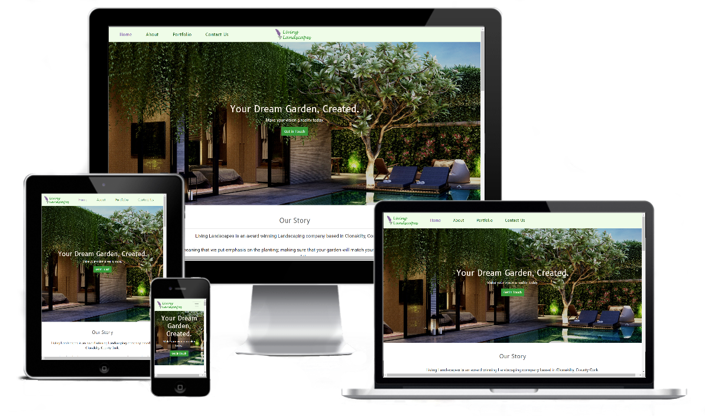
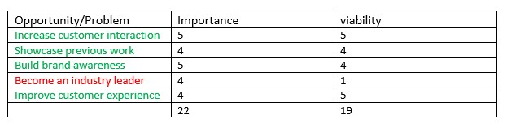
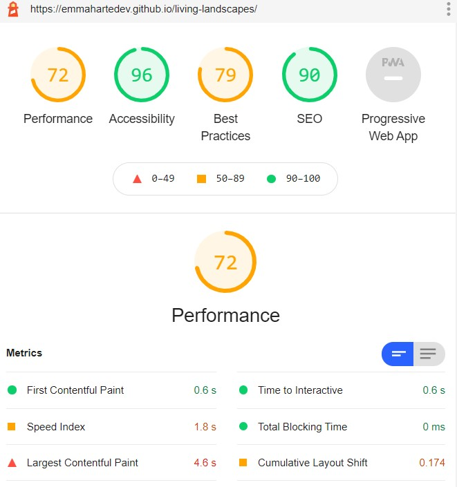
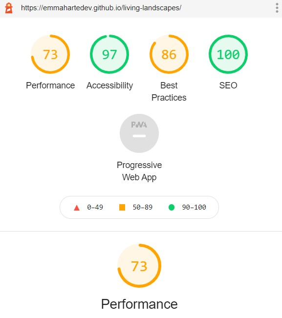
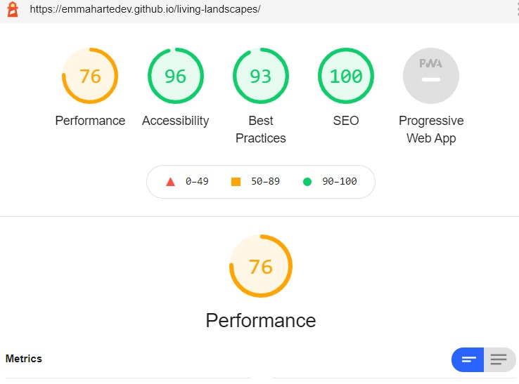

# Code Institute - Milestone One

## User-Centric Frontend Development 


## Living Landscapes - [Live Site](https://emmahartedev.github.io/living-landscapes/)



Living Landscapes is a fictitious landscaping company based in Clonakilty, Co. Cork.  
The company consists of 6 team members who provide 3 services, residential landscaping, commercial landscaping and garden maintenance. 

The company was founded in 2011 and has experienced significant growth in the last 5 years. 
With this is mind, the purpose of this website is to increase customer interaction, improve customer experience and build brand awareness. 

Important information and features to the company include: 

* Utilising the brand colors, purple and green throughout the website.
* Displaying the company's services.
* Conveying a strong message of excellent customer service.
* Listing information about the team and company.
* Offering an online method of contacting the team.
* Exhibiting past creations. 

----------------------------

## Contents
1. [UX](#ux "goto-ux")
    * [Project Goals](#project-goals "goto project goals")
    * [User Stories](#user-stories "goto user stories")
    * [Project Scope](#project-scope "goto project scope")
    * [Wireframes](#wireframes "goto wireframes")
    * [Surface](#surface "goto surface")

2. [Features](#features "goto features")
    * [Existing Features](#existing-features "goto existing features")
    * [Features Left to Implement](#features-left-to-implement "goto features left to implement")

3. [Technology Used](#technology-used "goto technology used")

4. [Testing](#testing "goto testing")
    * [User Story Testing](#user-story-testing " goto user story testing")
    * [Browser Compatibility](#browser-compatibility "goto browser compatibility")
    * [Responsiveness](#responsiveness "goto responsiveness")
    * [W3C Validation](#w3c-validation "goto w3c validation")
    * [Bugs](#bugs "goto bugs")
    

5. [Deployment](#deployment "goto deployment")

6. [Credits](#credits "goto credits")
    * [Contents](#code "goto code")
    * [Code](#code "goto code")
    * [Media](#media "goto media")
    * [Acknowledgements](#acknowledgements "goto acknowledgements")

----------------------------

## UX

### Project Goals
The goals of this website inlclude to:
* Increase customer Interaction
* Showcase previous work 
* Build brand awareness
* Improve customer experience

The following table displays a breakdown of all opportunities/problems along with their importance and viability.



While becoming an industry leader is important to compnay it is not viable in this release. 

### User Stories

#### Client stories
* As a prospective client, I would like to find an 'about' section on the website, so that I can learn about the company, it's services and qualification of the staff.

* As a prospective client, I would like to be able to send an online enquiry, so that I can receive additional information.

* As a client who would prefer to speak over the phone rather than email, I would like to be able to request a call-back to an online enquiry and clearly be able to view a telephone number and call-times.

* As a prospective client, I would like to view a portfolio of past work, so that I can know what to expect.  

* As a prospective client who is knowledgeable in horticulture, I would like to see proof that the company are plant experts as this is important to me in garden design. 

* As a prospective client who is not knowledgeable in garden design, I would like to see what options are available to me so that I can decide if this companay is right for me.  

* As an existing client and admirer of the company, I would like to be able to connect with and follow the company through social media platforms, so that I can build a connection with the brand.

#### Buisiness stories

* As a team member, I want to see my skills and strengths clearly defined in an 'About' section so that our clients will know I'm qualified.

* As a team member who deals with enquiries, I want to to know the user's name, phone number and email address so that I can get in contact with them.

* As a designer, I do not want prices to be posted online as quotes differ greatly dependending on the project and I really need to talk to the client first.

* As the CEO, I want all of our acheivements and past creations to be featured online. 

### Project Scope
Based on the above user stories, the following are features which will be inlcuded:

* Links to social platforms.
* A contact us form with an option to specify preferred method of contact.
* An 'About Us' section which will feature information about the team, company and services offered.
* A portfolio section which will contain examples of previous work.

The following is a list of features which will not be included: 

* Ecommerce functionality.
* Social media as an extention of the business.
* A blog.
* Back-end site development.
* Extensive content/imagery on portfolio examples.

### Wireframes
All wireframes were created using the software [Balsamiq](https://balsamiq.com/). 
Layouts were created following research on the five planes of UX and before coding. 
<strong>
Please note, the final website layout contains slight variations to the original wireframes.
</strong>

**Desktop** 
* [Home Page](assets/wireframes/desktop/dhome.png)
* [About Us](/assets/wireframes/desktop/dabout.png)
* [Portfolio](/assets/wireframes/desktop/dportfolio.png)
* [Contact Us](/assets/wireframes/desktop/dcontact.png)

**Tablet**
* [Home Page](assets/wireframes/tablet/thome.png)
* [About Us](assets/wireframes/tablet/tabout.png)
* [Portfolio](/assets/wireframes/tablet/tportfolio.png)
* [Contact Us](assets/wireframes/tablet/tcontact.png)

**Mobile**
* [Home Page](assets/wireframes/mobile/mhome.png)
* [About Us](assets/wireframes/mobile/mabout.png)
* [Portfolio](/assets/wireframes/mobile/mportfolio.png)
* [Contact Us](assets/wireframes/mobile/mcontact.png)


### Surface
A two color palette of green and purple was used. This took inspiration from the company logo and was included in background colors, navigation, font colours & hover elements.

All fonts used are from [Google Fonts ](https://fonts.google.com/). 

Fonts used include:
* B612 - used for all headings (h1 - h6).
* Roboto - used for other all body text.


----------------------------

## Features

### Existing Features 
* **Navigation** 
    * The navigation contains the brand logo and four links which lead to 4 seperate pages. 
    * The brand logo is an anchor tag, which is linked to the homepage. 
    * The pages are ordered to create a walk-through experience (Home > About > Portfolio > Contact Us)
    * For mobile devices, the navbar is designed to collapse.
    * This feature was created using Bootstrap 4 and styled in with custom CSS. 

* **Contact Us Form**
    * The contact form includes the necessary information required by the team. 
    * Several of the fields are required and the user will be alerted by a message if a required field has not been filled in. 
    * Due to the nature of consultation, prices on quotations were not provided on this form; as requested by the team. The forms acts as a general enquiry submission.
    * This feature was created using a Bootstrap 4 form and JavaScript.

* **Meet the Team**
    * All staff memebers are featured in the 'About' section. 
    * In addition to a text paragraph, Bootstrap 4 progress-bars are used to exhibit the employees key skills. 

* **About the Company**
    * The company's mission is found on the 'About' section, in a prime location just under the hero image. 
    * The services offered by the company are also included here. 
    * A Bootstrap 4 card is used to feature details on each service. 

* **Testimonials**
    * Testimonials are included on the 'Home' page.
    * Content includes the client's image, quotation and client details
    * A Bootstrap 4 card is used to hold the testimonial content. 
   

* **Portfolio**
    * Within the Portfolio page, award-winning garden designs are displayed seperately and include a gold-badge which shows the year in which the award was acheived. 
    * The company's recent creations are featured underneath, using an identical layout.

* **Footer**
    * The brand logo is featured on the footer left.
    * Quick contact links are included in the footer center.
    * Social media links are visable on the footer right.

### Features Left to Implement
Due to project scope, the following features were not implemented in the current release. 

These include:
* Back-end development - Server side development is required for functionality of the contact us form. 

* Map Integration - I would like to Integrate maps into the website, for added reference. 

* Image Carousel - I would like to include an image carousel feature for the indidual creation in the 'Portfolio' page.

* Request a quotation on contact form - This is an option for the future, depending on the requirements of the company. 

----------------------------

## Technology Used

* [HTML5](https://www.w3schools.com/html/) - Used for structuring the site pages.

* [CSS](https://www.w3schools.com/css/) - Used for styling the site pages.

* [Bootstrap 4](https://getbootstrap.com/) - Framework used for building the site pages.

* [Google Fonts](https://fonts.google.com/) - Used for typography.

* [Adobe Photoshop](https://www.adobe.com/de/products/photoshop.html?sdid=88X75SKP&mv=search&ef_id=EAIaIQobChMI95Sd8Zyv7QIVA893Ch3SYQCaEAAYASAAEgI41vD_BwE:G:s&s_kwcid=AL!3085!3!341205896389!e!!g!!adobe%20photoshop!1419109629!54636022246&gclid=EAIaIQobChMI95Sd8Zyv7QIVA893Ch3SYQCaEAAYASAAEgI41vD_BwE) - Used to resize and edit images.

* [Font Awesome](https://fontawesome.com/) - Used for all Icons.

* [Gitpod](https://www.gitpod.io/docs/) - Used as a development environment.

* [Github](https://github.com/) - Used for respository hosting.

* [Github Pages](https://pages.github.com/) - Used for site deployment.

* [Chrome Dev tools](https://developers.google.com/web/tools/chrome-devtools)- Used for monitoring the Responsiveness of the website.

* [Cross Browser Testing](https://crossbrowsertesting.com/) - Used for monitoring the Responsiveness of the website.

----------------------------
## Testing

### User Story Testing
The following user stories which were defined in the [UX](#ux "goto-ux") section of this README document were re-examined; to ensure that the needs and expectations of both the customer and client have been met. 

#### Clients Stories

* As a prospective client, I would like to find an 'about' section on the website, so that I can learn about the company, it's services and qualification of the staff.
    * A dedicated 'About' page has been created, which includes content on the company's mission, the services they provide and a detailed description on each team member and their skills.
    * The company's services are also viewable on the 'About' page. Within the footer, quick contact-us links have also been provided to encourage the user to get in touch with any queries. 

* As a prospective client, I would like to be able to send an online enquiry, so that I can receive additional information.
    * An online enquiry form has been created within the 'Contact Us' section. This has been created to be very easy-to-use, with integrated invalid messages prompted to appear if the user  has missed a required field. 
     * Quick links to the 'Contact Us' page have also been  included in the footer and in the header (hero image banner CTA) of each page. 
     * By encouraging the user to contact the company in many ways, a strong approachable message is conveyed. 

* As a client who would prefer to speak over the phone rather than email, I would like to be able to request a call-back to an online enquiry and clearly be able to view a telephone number and call-times.
    * A preferred method of contact can be specified on the online enquiry form. 
    * The company's contact telephone number is also visable on the footer of each page.
    * The compnay's contact telephone number with the message 'Want To Chat? So Do We!' is displayed on the 'Home' & 'Contact Us' page. 

* As a prospective client, I would like to view a portfolio of past work, so that I will know what to expect.  
    * A dedicated Portfolio' page has been created.
    * 'Award-Winning Gardens' are displayed first, showing the company's greatest acheivements.
    * 'Our Recent Creations' shows an additional six garden designs with a date and discription included. 
    * A variety of residential and commerical designs have been included to give a well-rounded representation of the company. 
    * A CTA on the hero image banner enourages the user to contact the compnay if they have any additional questions. 

* As a prospective client who is knowledgeable in horticulture, I would like to see proof that the company are plant experts as this is important to me in garden design. 
    * Portraying a strong message of plant knowledge was taken into consideration when creating every page. 
    * The company is branded as 'plant-first landscapers'; a message which is portrayed in the footer and the header blurb (under-neath the hero image banner) of pages. 
    * In the 'About' page, the user can learn about the employeees and their skills which are displayed using progress bars. 
    * In each creation listed on the 'Portfolio' page, all horticultural aspects of the projects are described. 

* As a prospective client who is not knowledgeable in garden design, I would like to see what options are available to me so that I can decide if this company is right for me.  
    * All services provided by the company are listed in the 'About' web page. 
    * All services provided and company description are included on the footer of each page. 
    * The company's past creations are viewable in the 'Portfolio' page. This gives an in-depth overview of the standard of work which can be expected. 
    * Testimonials are viewable on the 'Home' page, which give positive feedback on the company, showcasing how approachable the company is. 
    

* As an existing client and admirer of the company, I would like to be able to connect with and follow the company through social media platforms, so that I build a connection with the brand.
    * Quick links to the compnay's social media platforms are viewable on the footer of each page. 


#### Buisiness Stories

* As a team member, I want to see my skills and strengths clearly defined in an 'About' section so that our clients will know I'm qualified.
    * A defined colour palette is used to display each employees skills.
    * A content block of text also compliments the progress bars.
* As a team member who deals with enquiries, I want to to know the user's name, phone number and email address so that I can get in contact with them.
    * The stated fields are marked required.

* As a designer, I do not want prices to be posted online as quotes differ greatly dependending on the project and I really need to talk to the client first.
    * Prices are not viewable on any section of the website. 
    * An explanation of why prices are excluded is included in the blurb section of the 'Contact us' page.

* As the CEO, I want all of our acheivements and past creations to be featured online. 
    * Awards acheived are diplayed on the hompage, with images of the projects visable on the 'Portfolio' page. 

### Browser Compatibility
As stated by [w3schools](https://www.w3schools.com/browsers/), the most used popular browsers in October 2020 are:

1. Chrome (80.4 %)
2. Edge (5.2 %)
3. Firefox (7.1 %)
4. Safari (3.7 %)

[Cross Browser Testing](https://crossbrowsertesting.com/) was used to access the quality of the website on the above four browsers.
During testing, a bug which affected all links  was discovered and this has been documented in the [Bugs Section](#bugs "goto bugs").
Other than this, no issues in compatibility were recorded. 
Internet explorer was also checked and it was discovered that several Bootstrap features did not work on this browser. 
Fixing these bugs in this release was not deemed as priority due to the fact that IE is no longer supported by Microsoft.


### Responsiveness
The website's reponsiveness was continuously monitored, throughout the development of this project using [Chrome Dev Tools](https://developers.google.com/web/tools/chrome-devtools).

In addition to this, [Lighthouse](https://developers.google.com/web/tools/lighthouse) was run in Chrome Dev Tools, to generate reports on the qulity of the website.

The below image shows a screenshot of the lighthouse report for mobile devices.


The following actions were taken to improve performance:

* All images were converted to png format.  
* Custom hero banner images were created for mobile devices. 

The following actions were taken to improve best practices:
* 'rel="noopener"' was added to all external links to improve performance and prevent security vulnerabilities.
* All unused classes were removed.
* The color contrast of colours was increased.

The following actions were taken to improve SEO:
* Meta descriptions were added to all html pages.

The changes made can be seen to have made an improvement in the following Lighthouse screenshot:




The changes also made a positive impact on Desktop devices



### W3C Validation
The validity of each page's HTML code was checked using [The W3C Markup Validation Service](https://validator.w3.org/).
The following code changes were made to satisy the validator:

* In index.html
    * Within the ul element, all h4 and a href elements were removed.
    * within the navbar-toggler class button element, the aria-controls attribute was corrected.

* contact.html
    * Within the contact form, the legend element was replaced with a div.


The validity of the CSS code was checked using [The W3C CSS Validation Service](https://jigsaw.w3.org/css-validator/).
No errors were found.

### Bugs

1. Upon deploying the site on Github pages the path links did not work. 
    * In all pages, clicking an 'a href' link led to a 404 page, however all links were working correctly when locally deployed. 
    * The issue was resolved by correcting the pathways so that they could be read outside the local environment.
    * [Pluralsight](https://www.pluralsight.com/guides/fixing-broken-relative-links-on-github-pages), [Code Academy Forums](https://discuss.codecademy.com/t/css-not-working-on-github-pages/440469/2) and [Coffee Cup](https://www.coffeecup.com/help/articles/absolute-vs-relative-pathslinks/) articles assisted in ammending this issue. 

----------------------------

## Deployment

The website was hosted on Github Pages. It was deployed by carrying out the following steps:

1. login into Github
2. Select the respository from profile
3. go to 'settings' in respo
4. In 'Github Pages' choose 'Master Branch' as Source and save.

The Live site deployed can be viewed on the following link: 
[Living Landscapes](https://emmahartedev.github.io/living-landscapes/)

### Local
To clone this project locally; a Chrome browser and Github account are required. 

The following steps can then be followed:
1. Install the [Gitpod Browser Chrome Extention](https://chrome.google.com/webstore/detail/gitpod-dev-environments-i/dodmmooeoklaejobgleioelladacbeki), restarting the browser after installation.
2. Log into [Gitpod](https://gitpod.io/).
3. Click on the following link to go to the [project repository](https://github.com/emmahartedev/living-landscapes).
4. Click on the green 'Gitpod' button which is located to the right of the repository to launch a new workspace.
5. The code can be worked on in this newly launched workspace. 

To clone code within an IDE of your choice:

1. Click on the following link to go to the [project repository](https://github.com/emmahartedev/living-landscapes).
2. Click 'Code' and in the Clone with HTTPs, copy the provided repository URL. 
3. Open a terminal in your IDE.
4. Change the current working directory to the location you wish to generate the cloned directory.
5. Type git clone, and then paste the URL from step 2. 

```
git clone https://github.com/emmahartedev/living-landscapes.git
```

----------------------------

## Credits 

### Content
All content was written and developed by me.

### Code
The following websites were used for inspiration and assistance:

* [CSS Tricks](https://css-tricks.com/)
* [Awwwards](https://www.awwwards.com/)
* [Stack Overflow](https://stackoverflow.com/)

###  Media
The images used on this site are royalty free and were obtained from the following websites:

* [Unsplash](https://unsplash.com/)
* [Pexels](https://www.pexels.com/de-de/)
* [Pixabay](https://pixabay.com/de/)

### Acknowledgements
I would like to thank my Code Institute mentor, Mark Railton for his support and guidance throughout this project. 